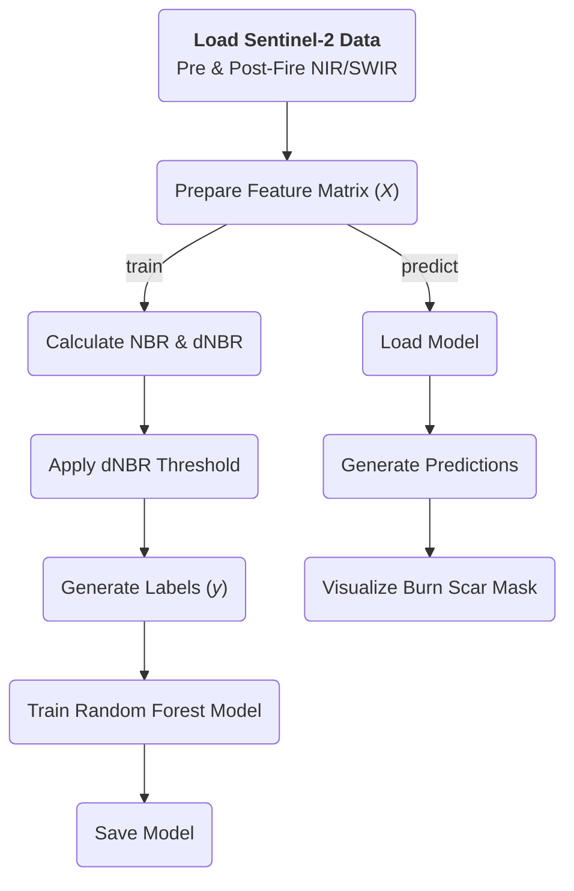

# Burn Scar Detection using dNBR and Random Forest from Sentinel-2 Imagery


[](https://opensource.org/licenses/MIT)

## Abstract

This project provides a command-line tool for detecting wildfire burn scars from multi-temporal Sentinel-2 satellite imagery. It implements a supervised machine learning workflow that leverages the spectral information from Near-Infrared (NIR) and Short-Wave Infrared (SWIR) bands. The methodology first generates training labels by thresholding the Differenced Normalized Burn Ratio (dNBR), a robust indicator of vegetation change due to fire. Subsequently, a Random Forest Classifier is trained on the raw pre- and post-fire spectral bands to produce a binary classification map of burned and unburned areas. This tool is designed for researchers and practitioners in remote sensing, environmental science, and disaster management.

## Table of Contents

- [Abstract](#abstract)
- [Table of Contents](#table-of-contents)
- [Introduction](#introduction)
- [Methodology](#methodology)
  - [Normalized Burn Ratio (NBR)](#normalized-burn-ratio-nbr)
  - [Label Generation via dNBR](#label-generation-via-dnbr)
  - [Random Forest Classification](#random-forest-classification)
- [System Requirements](#system-requirements)
- [Installation](#installation)
- [Data Preparation](#data-preparation)
- [Usage](#usage)
  - [1. Train the Model](#1-train-the-model)
  - [2. Predict a Burn Scar Mask](#2-predict-a-burn-scar-mask)
- [Workflow Diagram](#workflow-diagram)
- [Example Output](#example-output)
- [Limitations](#limitations)
- [License](#license)
- [Contributing](#contributing)

## Introduction

The accurate and timely mapping of wildfire burn scars is critical for assessing environmental damage, monitoring ecosystem recovery, and managing post-fire hazards. Satellite remote sensing offers a cost-effective means for this task. The Sentinel-2 mission, with its 20-meter resolution spectral bands in the NIR and SWIR regions, is particularly well-suited for this purpose.

This tool automates the process of burn scar detection by combining a well-established spectral index (dNBR) with a powerful machine learning algorithm (Random Forest). It provides a complete workflow from data ingestion to model training and final prediction.

## Methodology

The detection process is based on a supervised classification approach where training labels are derived from the dNBR index.

### Normalized Burn Ratio (NBR)

The NBR is a spectral index sensitive to the presence of live green vegetation. It is calculated using the Near-Infrared (NIR) and Short-Wave Infrared (SWIR) bands. For Sentinel-2, this corresponds to Band 8A (NIR) and Band 12 (SWIR).

$$
\text{NBR} = \frac{(\text{NIR} - \text{SWIR})}{(\text{NIR} + \text{SWIR})}
$$

Healthy vegetation exhibits high NIR reflectance and low SWIR reflectance, resulting in a high NBR value. Conversely, burned areas have lower NIR and higher SWIR reflectance, leading to a low NBR.

### Label Generation via dNBR

The change in NBR before and after a fire event is a strong indicator of burn severity. This change is captured by the Differenced Normalized Burn Ratio (dNBR):

$$
\text{dNBR} = \text{NBR}\_{\text{pre-fire}} - \text{NBR}\_{\text{post-fire}}
$$

High dNBR values indicate a significant drop in vegetation health, corresponding to burned areas. This tool uses a dNBR threshold to automatically generate binary training labels. Pixels where `dNBR > 0.2` are labeled as "Burned" (class 1), while all other pixels are labeled as "Unburned" (class 0).

### Random Forest Classification

While dNBR is used for label generation, the final classification model is a Random Forest. This ensemble learning method is trained to distinguish between burned and unburned classes using the raw reflectance values of the input bands as features. For each pixel, the feature vector is constructed as:

$$
\vec{x} = [\text{NIR}\_{\text{pre-fire}}, \text{SWIR}\_{\text{pre-fire}}, \text{NIR}\_{\text{post-fire}}, \text{SWIR}\_{\text{post-fire}}]
$$

This approach allows the model to learn more complex, non-linear relationships between the spectral signatures and the burn state, potentially leading to a more robust classification than a simple dNBR threshold.

## System Requirements

- Python 3.12+
- The `uv` package manager is recommended for installation.

## Installation

1.  **Clone the repository:**

    ```bash
    git clone git@github.com:brunosag/burn-scar-detection.git
    cd burn-scar-detection
    ```

2.  **Create a virtual environment and install dependencies:**
    Using `uv` is recommended for fast and reliable dependency management.

    ```bash
    # Install uv if you don't have it
    curl -LsSf https://astral.sh/uv/install.sh | sh

    # Create and activate a virtual environment
    uv venv
    source .venv/bin/activate

    # Install the project and its dependencies
    uv pip install .
    ```

## Data Preparation

The tool requires pre- and post-fire Sentinel-2 imagery. Specifically, you need to acquire **Band 8A (NIR)** and **Band 12 (SWIR)** for both time periods.

1. **Acquire Data:** Download the required `.jp2` band files from a source like the [Copernicus Open Access Hub](https://scihub.copernicus.eu/). For best results, it is highly recommended to use **Level-2A** products, as they are atmospherically corrected to provide Bottom-Of-Atmosphere (BOA) reflectance values.

2. **Directory Structure:** Place the band files into a directory named `bands/` in the root of the project. The script expects the following specific filenames:
   ```
   burn-scar-detection/
   ├── bands/
   │   ├── post_B8A.jp2
   │   ├── post_B12.jp2
   │   ├── pre_B8A.jp2
   │   └── pre_B12.jp2
   ├── main.py
   └── ...
   ```

## Usage

The tool provides a command-line interface with two main actions: `train` and `predict`.

### 1. Train the Model

This command processes the input bands, generates labels using the dNBR threshold, trains a Random Forest classifier, and saves the trained model to a file.

```bash
burn-scar train
```

This will create a file named `burn_scar_rf_model.joblib` in the project's root directory.

### 2. Predict a Burn Scar Mask

This command loads the pre-trained model (`burn_scar_rf_model.joblib`) and uses it to predict the burn scar mask for the input imagery. The resulting binary mask is then displayed on screen.

```bash
burn-scar predict
```

## Workflow Diagram

The diagram below illustrates the two primary workflows of the tool: training and prediction. The data preparation stage is common to both processes.



## Example Output

Running the `predict` command will generate and display the final classification result. The image below shows the model's output for an area affected by the February 2024 wildfires in the Valparaíso Region, Chile.


_Figure 1: Burn scar mask generated by the Random Forest model for the 2024 wildfires in the Valparaíso Region, Chile. Burned areas are shown in white, and unburned areas are in black._

## Limitations

- **Label Quality:** The accuracy of the model is highly dependent on the quality of the labels generated by the dNBR threshold. The fixed threshold of `0.2` is a general heuristic and may not be optimal for all ecosystems or fire severities.
- **Generalization:** The current workflow trains and predicts on the same dataset. For a rigorous scientific application, the model should be trained on a diverse set of scenes and validated on a separate, unseen test dataset to assess its true generalization performance.
- **Atmospheric & Cloud Effects:** The tool assumes the input imagery is clear and free of clouds, haze, and smoke, which can significantly impact spectral reflectance and lead to classification errors. Pre-processing steps like atmospheric correction are recommended for best results.

## License

This project is licensed under the MIT License. See the `LICENSE` file for details.

## Contributing

Contributions are welcome. Please feel free to open an issue or submit a pull request for any bugs, features, or improvements.
